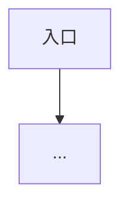

# 原型盘点稿模板

**路径**：`docs/YYYY-MM-DD-<主题>-原型盘点.md`

---

## 文首元数据（推荐）

```markdown
> **文档类型**：原型/站点功能盘点（PRD 前置真源）
> **输入源**：Axure 导出 @ `路径` / URL：`https://...` / 混合
> **盘点范围**：全站 / 模块 XXX / 共 N 页
> **盘点日期**：YYYY-MM-DD
> **关联 PRD**：（完成后填 `docs/YYYY-MM-DD-<主题>-PRD.md`）
```

---

## 正文结构

```markdown
# 【产品名称】原型盘点（暂定）

## §1 输入与限制
- 来源说明、版本/导出时间、未覆盖范围（登录后、移动端等）
- 盘点方法限制（见 web-site-inventory / axure-html-parse）

## §2 站点地图 / 页面清单

| 序号 | 页面名称 | 路径或文件 | 模块 | 优先级建议 |
| --- | --- | --- | --- | --- |
| 1 | 登录 | files/登录/登录.html | 账号 | 🔴 |

（树状可选）
```

产品名
├── 🔴 模块A
│   ├── 页面1
│   └── 页面2
└── 🟡 模块B
    └── 页面3
```

## §3 公共模块
### 3.1 全局导航 / 布局壳
（顶栏、侧栏、底栏 — 各页复用部分）

## §4 分页面要点

### 4.x 【页面名称】（`路径`）

**页面目的**：（一句话）

**布局骨架**：（ASCII，可选）

**关键控件与文案**
| 区域 | 类型 | 文案/字段 | 说明 |
| --- | --- | --- | --- |

**交互与跳转**
| 触发 | 动作 | 目标 | 条件 | 来源/标注 |

**状态与分支**：（动态面板、空态、错误态）

**待确认**：[...]

（每页重复 4.x）

## §5 主用户动线（草稿）



## §6 功能聚合表（页面 → 功能）

| 功能模块 | 涉及页面 | 要点 | MVP 建议 |
| --- | --- | --- | --- |
| 用户登录 | 登录、注册 | 手机+验证码 | 🔴 |

## §7 三视角缺口（盘点无法得出）

- **用户/商业**：（待访谈）
- **技术/数据**：（待确认）
- **规则与权限**：[原型未标明] 项清单

## §8 变更记录
| 日期 | 说明 |
| --- | --- |
| YYYY-MM-DD | 初稿 |
```

---

## 填写原则

1. **可验证**：每条交互尽量给出来源（文件名、注解、URL）
2. **标注三类**：事实 / `[推断]` / `[原型未标明]`
3. **不写验收标准**：验收放在落地 PRD §5
4. 用户确认盘点后，再进入概念版；盘点有重大更新时同步改 §6、§7
