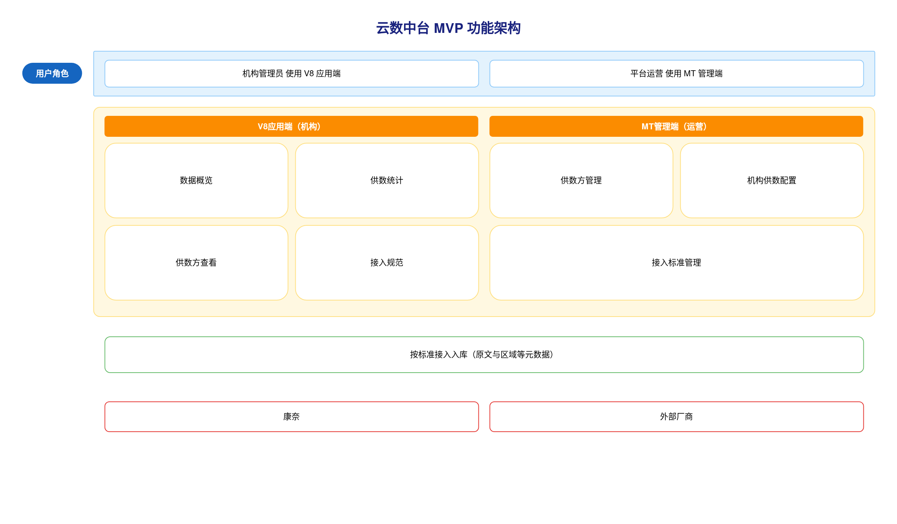

# 云数中台 · SRS需求规格说明书

## 一、文档信息

| 项目名称 | 云数中台 |
|---------|-----------|
| 文档版本 | V1.0 |
| 编制日期 | 2026-09-03 |
| 编制人 | 产品四部 / AI |
| 审核人 | - |
| 批准人 | - |
| 客户单位 | 产品四部 |
| 编制单位 | 产品四部 |
| 适用范围 | MVP：V8 应用端（机构）与 MT 管理端（运营）的接入走通 |
| 核心目标 | 按中台标准接入各供数方舆情数据并原文入库，机构查看各供数方入库量并下载接入规范 |
| 文档状态 | 草稿 |

> **文档类型**：SRS 需求规格说明书（研发真源）  
> **交付模式**：标准  
> **设计来源**：`docs/01-需求与规划/2026-09-03-云数中台-设计方案-v1.1.md`  
> **说明**：`docs/2026-09-01-云数中台-PRD.md` 与设计方案 v1.0 中的三维质量对比、抽检等不作为本期 MVP 范围，列入后期。

**历史版本**

| 版本 | 日期 | 作者 | 更改说明 |
|-----|------|------|---------|
| V1.0 | 2026-09-03 | 产品四部 / AI | 按方案 A 与两端架构生成 MVP 规格 |

---

## 二、项目概述

### 2.1 项目背景

随着多厂商舆情供数并行，机构与公司在统一接收、对账与对接上面临以下问题：

1. **接入口径不统一**：各供数方格式自行约定，机构难以按同一套要求完成对接，公司也难以汇总核对。
2. **机构无法自助取得标准**：接入要求散落在线下文档，机构不便查阅、下载并转交给供数方。
3. **供数是否到达缺少统一查看**：机构需要确认康奈及各厂商承诺数据是否进入中台，目前缺少按供数方查看入库量的入口。
4. **质量对比能力尚不具备底座**：及时性、准确性等对比是后续方向，需先完成标准接入与原文入库，避免一期范围过大。

为解决上述问题，建设云数中台：由中台规定接入标准与元数据，供数方按标准送数并入库；机构在 V8 应用端下载规范、查看入库量；运营在 MT 管理端维护供数方、配置机构可接收范围并发布标准。

### 2.2 项目建设目标

1. **统一接入标准**：中台维护一份接入标准文档，机构可查阅下载并转交给供数方，供数方按该标准向中台送数。
2. **完成原文入库**：将康奈及各厂商按承诺提供给机构的舆情数据按标准入库，区域等元数据一并保存，为后期按区域查看与质量对比预留数据。
3. **机构可核验入库量**：机构管理员在本机构范围内查看各已配置供数方的入库条数，确认数据是否进入中台。
4. **运营可配置供数关系**：平台运营维护供数方（含康奈），指定各机构可接收的供数方，未配置的数据不计入该机构。
5. **权限可扩展**：本期机构侧仅机构管理员，管理端为平台运营；权限按角色配置，后续可增加新角色而不改变主流程。

### 2.3 项目建设范围

**系统端**：

- V8 应用端：机构用户使用的 Web 应用
- MT 管理端：我司运营人员使用的 Web 管理端

**功能模块**：

- V8：数据概览、供数统计、供数方查看、接入规范
- MT：供数方管理、机构供数配置、接入标准管理
- 按标准接入入库（系统能力，两端本期不提供正文查阅）

**数据范围**：

- 供数方主数据（含康奈与外部厂商）
- 机构与供数方的接收配置
- 接入标准文档（全平台一份）
- 按标准入库的舆情原文及元数据（含区域、到达中台时间等）
- 按机构、供数方汇总的入库条数

**不包含的功能（后期）**：

- 按主题或信源开通、三维质量对比看板
- 抽检与准确性计算
- 机构端按区域切片查看、查阅单条正文
- 研判员等新角色的独立菜单（权限模型预留）
- 接入标准多版本与按供数方分文档
- 未映射处理工作台、接入异常监控大盘
- 外部结果外推与开放对接生态

### 2.4 业务流程图

### 2.5 业务角色定义

| 角色名称 | 角色描述 | 主要职责 | 权限范围 |
|---------|---------|---------|---------|
| 机构管理员 | 机构在 V8 应用端的本期使用者 | 查看数据概览与供数统计；查看已配置供数方；下载接入规范 | 仅本机构数据；不可配置供数关系、不可上传标准、不可查阅正文 |
| 平台运营 | 我司在 MT 管理端的使用者 | 维护供数方；为机构配置可接收的供数方；上传或替换接入标准 | 供数方与配置、标准文档；不代替机构查看统计作为业务核验入口 |

---

## 三、项目建设内容

### 3.1 总体功能架构

**V8 应用端（机构）**

- 数据概览（一级菜单）
- 供数统计（一级菜单）
- 供数方查看（一级菜单）
- 接入规范（一级菜单）

**MT 管理端（运营）**

- 供数方管理（一级菜单）
- 机构供数配置（一级菜单）
- 接入标准管理（一级菜单）

### 3.2 需求功能清单

| 序号 | 业务需求 | 需求概述 | 优先级 |
|-----|---------|---------|-------|
| 1 | 统一接入标准 | 中台发布一份接入标准，机构下载并转交供数方，供数方按标准送数 | P0 |
| 2 | 供数方与康奈接入 | 维护供数方（含康奈与外部厂商），按标准将承诺给机构的舆情数据原文入库 | P0 |
| 3 | 机构供数范围 | 由运营指定机构可接收的供数方，未配置的不计入该机构 | P0 |
| 4 | 机构核验入库量 | 机构管理员查看本机构各已配置供数方的入库条数与概览汇总 | P0 |
| 5 | 角色与机构隔离 | 机构管理员使用 V8，平台运营使用 MT，数据按机构隔离，角色可扩展 | P0 |

### 3.3 页面功能清单

| 终端 | 一级菜单 | 二级菜单 | 子功能 | 功能描述 |
|-----|---------|---------|-------|---------|
| V8应用端 | 数据概览 | - | 汇总查看 | 查看本机构已配置供数方数量、入库总条数、最近一次入库时间 |
| ^ | ^ | - | 快捷进入 | 进入供数统计或接入规范 |
| ^ | 供数统计 | - | 筛选 | 按全部、近7天或近30天查看入库条数 |
| ^ | ^ | - | 列表 | 按供数方分页查看名称与入库条数 |
| ^ | 供数方查看 | - | 列表 | 查看本机构已配置供数方的名称与状态 |
| ^ | 接入规范 | - | 查看 | 查看当前接入标准的文件名、类型、大小、发布时间 |
| ^ | ^ | - | 下载 | 下载当前接入标准文档 |
| MT管理端 | 供数方管理 | - | 筛选 | 按名称、状态查找供数方 |
| ^ | ^ | - | 列表 | 分页查看供数方名称、编码、状态、更新时间 |
| ^ | ^ | - | 新增 | 登记供数方名称、编码与状态 |
| ^ | ^ | - | 编辑 | 变更供数方名称、编码与状态 |
| ^ | ^ | - | 启用停用 | 启用或停用供数方 |
| ^ | ^ | - | 删除 | 在未被机构引用时删除供数方 |
| ^ | 机构供数配置 | - | 筛选 | 按机构查找供数配置 |
| ^ | ^ | - | 列表 | 查看机构已配置的供数方 |
| ^ | ^ | - | 编辑 | 为机构勾选或取消可接收的供数方 |
| ^ | 接入标准管理 | - | 查看 | 查看当前标准文件名、大小、上传人、上传时间 |
| ^ | ^ | - | 上传 | 上传 Word 或 PDF 作为当前接入标准 |
| ^ | ^ | - | 替换 | 用新文件替换当前接入标准 |

### 3.4 页面访问权限

| 功能模块 | 机构管理员 | 平台运营 |
|---------|-----------|---------|
| 数据概览 | 全部权限 | 无 |
| 供数统计 | 全部权限 | 无 |
| 供数方查看 | 全部权限 | 无 |
| 接入规范 | 全部权限 | 无 |
| 供数方管理 | 无 | 全部权限 |
| 机构供数配置 | 无 | 全部权限 |
| 接入标准管理 | 无 | 全部权限 |

### 3.5 功能详细设计

### 3.5.1 数据概览

**（一）功能需求概述**

数据概览供机构管理员进入 V8 应用端后查看本机构供数是否到达中台。集中展示已配置供数方数量、入库总条数和最近一次入库时间，并进入供数统计或接入规范。

**（二）功能设计**

**汇总查看功能**

| 字段名称 | 类型 | 说明 |
|---------|------|------|
| 已配置供数方数量 | 数值 | 机构供数配置中本机构当前勾选的供数方个数，含状态为停用的供数方 |
| 入库总条数 | 数值 | 到达中台时间不限制的累计条数，与供数统计「全部」同一口径；含已停用供数方的历史计入条数，不含停用后新数据；无数据时为 0 |
| 最近一次入库时间 | 日期时间 | 本机构应统计记录中最晚一条的到达中台时间；无入库时显示「暂无入库」 |

**快捷进入功能**

机构管理员可进入供数统计或接入规范。进入后打开对应功能；目标页无数据或标准未发布时，按目标功能自身提示展示。

**业务规则**

- 仅统计本机构已配置供数方对应的入库数据。未配置的供数方不计入三项汇总。无单独提示。
- 本期不展示调性、及时性、准确性，不提供按区域查看，不提供单条正文查阅。无单独提示。

**边界与异常**

- **空数据**：尚无入库时，入库总条数为 0，最近一次入库时间显示「暂无入库」
- **权限不足**：平台运营在 V8 无此功能入口（不展示，非禁用）
- **未配置供数方**：已配置供数方数量为 0，入库总条数为 0，最近一次入库时间显示「暂无入库」

**（三）业务逻辑关联**

- 已配置供数方数量依赖机构供数配置
- 入库总条数与最近一次入库时间依赖按标准接入入库及供数统计同一口径

**（四）用户操作流程图**

**（五）功能时序图**

### 3.5.2 供数统计

**（一）功能需求概述**

供数统计供机构管理员按供数方核验本机构入库条数，确认各供数方（含康奈）数据是否进入中台。

**（二）功能设计**

**筛选功能**

条件之间为「与」关系，选择后触发查询：

| 筛选字段 | 类型 | 说明 |
|---------|------|------|
| 时间范围 | 单选 | 枚举值：全部、近7天、近30天；按到达中台时间过滤；默认全部 |

**列表功能**

| 列名 | 字段类型 | 说明 |
|-----|---------|------|
| 供数方名称 | 文本 | 来源于供数方管理中已配置给本机构的供数方 |
| 入库条数 | 数值 | 筛选时间范围内本机构该供数方已入库条数；已配置但未入库显示 0 |

分页默认每页 10 条，支持切换每页数量。
列表为空时显示：暂无入库数据。
不提供进入单条正文。

**业务规则**

- 未在机构供数配置中勾选的供数方不出现在列表中，不计入条数。无单独提示。
- 时间范围为近7天或近30天时，仅统计到达中台时间落在该区间的入库条数。无单独提示。

**边界与异常**

- **空数据**：本机构未配置任何供数方，或筛选后无行可展示时，显示「暂无入库数据」
- **权限不足**：平台运营无此功能入口（不展示，非禁用）

**（三）业务逻辑关联**

- 列表供数方来源于机构供数配置
- 入库条数来源于按标准接入入库中归属本机构且供数方已配置的数据

**（四）用户操作流程图**

**（五）功能时序图**

### 3.5.3 供数方查看

**（一）功能需求概述**

供数方查看供机构管理员只读了解本机构已配置的供数方，便于与供数统计对照，不能在 V8 增减供数关系。

**（二）功能设计**

**列表功能**

| 列名 | 字段类型 | 说明 |
|-----|---------|------|
| 供数方名称 | 文本 | 来源于机构供数配置中为本机构勾选的供数方 |
| 状态 | 状态标签 | 启用 / 停用，来源于供数方管理中的供数方状态 |

分页默认每页 10 条，支持切换每页数量。
列表为空时显示：尚未配置供数方，请联系平台运营。
不提供新增、编辑、删除。

**业务规则**

- 供数方由平台运营在机构供数配置中指定。机构管理员不能增减。无单独提示。
- 供数方在供数方管理中被停用后，本列表仍展示该供数方，状态为停用。无单独提示。

**边界与异常**

- **空数据**：本机构尚未配置任何供数方时，显示「尚未配置供数方，请联系平台运营」
- **权限不足**：平台运营无此功能入口（不展示，非禁用）

**（三）业务逻辑关联**

- 列表数据依赖机构供数配置与供数方管理
- 与供数统计对照同一套已配置供数方

**（四）用户操作流程图**

**（五）功能时序图**

### 3.5.4 接入规范

**（一）功能需求概述**

接入规范供机构管理员取得中台统一的接入标准文档，下载后转交给供数方，按标准向中台送数。

**（二）功能设计**

**查看功能**

| 字段名称 | 类型 | 说明 |
|---------|------|------|
| 文件名 | 文本 | 当前全平台一份接入标准的文件名称 |
| 文件类型 | 文本 | Word 或 PDF |
| 文件大小 | 文本 | 当前文件大小 |
| 发布时间 | 日期时间 | 平台运营最近一次上传或替换成功的时间 |

页内说明原文：请下载接入标准后转交供数厂商，按标准推送数据。

**下载功能**

存在当前标准文件时，机构管理员可下载该文件。系统不提供代为转交供数方。

**业务规则**

- 全平台仅一份当前有效文档，所有机构看到的内容相同。无单独提示。
- 平台运营替换文件后，机构端仅可下载新文件。已自行保存的旧文件系统不回收。无版本号提示。

**边界与异常**

- **空数据**：尚未上传标准时，不提供下载，显示「接入规范尚未发布，请联系平台运营」
- **权限不足**：平台运营在 V8 无此功能入口（不展示，非禁用）
- **下载失败**：保留页面，显示「下载失败，请稍后重试」

**（三）业务逻辑关联**

- 文件内容来源于接入标准管理中当前文档
- 供数方按该标准送数后进入按标准接入入库

**（四）用户操作流程图**

**（五）功能时序图**

### 3.5.5 供数方管理

**（一）功能需求概述**

供数方管理供平台运营维护向中台送数的来源，康奈与外部厂商使用同一份名单，供机构供数配置勾选。

**（二）功能设计**

**筛选功能**

| 筛选字段 | 类型 | 说明 |
|---------|------|------|
| 供数方名称 | 文本输入 | 支持模糊查找 |
| 状态 | 单选 | 枚举值：全部、启用、停用；默认全部 |

**列表功能**

| 列名 | 字段类型 | 说明 |
|-----|---------|------|
| 供数方名称 | 文本 | - |
| 编码 | 文本 | 对接标识 |
| 状态 | 状态标签 | 启用 / 停用 |
| 更新时间 | 日期时间 | 系统记录最近一次保存时间 |
| 操作 | 操作按钮 | 编辑、启用或停用、删除（无权限时隐藏） |

分页默认每页 10 条，支持切换每页数量。
列表为空时显示：暂无供数方数据。

**新增功能**

| 字段名称 | 类型 | 长度限制 | 必填 | 默认值 | 说明 |
|---------|------|---------|------|-------|------|
| 供数方名称 | 文本输入 | 1-50字 | 是 | - | 系统内全局唯一 |
| 编码 | 文本输入 | 2-32字 | 是 | - | 系统内唯一 |
| 状态 | 单选 | - | 是 | 启用 | 启用 / 停用 |

提交成功：提示「新增成功」。
提交失败：保留填写内容，显示具体错误原因。

**编辑功能**

进入编辑后自动填入当前记录，字段同新增。
提交成功：提示「保存成功」。

**启用停用功能**

停用时弹出确认：「停用后将停止为已配置机构计入该供数方新数据，已入库条数仍计入机构历史总量。确定停用？」
确认后停止为已配置机构计入该供数方新数据，原文仍按标准保存，历史已计入条数不扣减。
启用后可继续为已配置机构计入新数据。
成功提示：「状态已更新」。

**删除功能**

点击「删除」，弹出确认：「确定删除该供数方？」
若已被任一机构在机构供数配置中引用，阻止删除，提示「已被机构引用，请停用」。
删除成功：提示「删除成功」。

**业务规则**

- 供数方名称在系统内全局唯一。新增或编辑时若重复，阻止提交，提示「该名称已存在」。
- 编码在系统内唯一。新增或编辑时若重复，阻止提交，提示「该编码已存在」。
- 停用后，已配置机构不再计入该供数方新数据，原文仍保存，历史已计入条数不扣减。无单独向机构提示。

**边界与异常**

- **空数据**：列表无数据时，显示「暂无供数方数据」
- **权限不足**：机构管理员无此功能入口（不展示，非禁用）

**（三）业务逻辑关联**

- 供数方被机构供数配置引用后不可删除，仅可停用
- 停用影响按标准接入入库是否计入对应机构的新数据

**（四）用户操作流程图**

**（五）功能时序图**

### 3.5.6 机构供数配置

**（一）功能需求概述**

机构供数配置供平台运营指定某机构可接收哪些供数方。机构管理员不在 V8 开通或勾选。

**（二）功能设计**

**筛选功能**

| 筛选字段 | 类型 | 说明 |
|---------|------|------|
| 机构 | 文本输入或选择 | 来源于系统中已有机构，按名称查找 |

**列表功能**

| 列名 | 字段类型 | 说明 |
|-----|---------|------|
| 机构名称 | 文本 | 来源于系统已有机构 |
| 已配置供数方 | 文本 | 该机构当前勾选的供数方名称，多个时逐个展示；未配置显示「-」 |
| 操作 | 操作按钮 | 编辑 |

分页默认每页 10 条，支持切换每页数量。
列表为空时显示：暂无机构数据。

**编辑功能**

为指定机构勾选可接收的供数方。选择范围为供数方管理中状态为启用的供数方。可取消已勾选的供数方。
提交成功：提示「保存成功」。

**业务规则**

- 未勾选的供数方，即使送来数据，也不计入该机构的数据概览与供数统计。无单独提示。
- 取消某供数方后，该机构不再计入该供数方新数据，已入库历史条数不扣减。无单独提示。
- 机构侧不提供开通或勾选。配置错误由平台运营在本功能调整。

**边界与异常**

- **空数据**：无机构可展示时，显示「暂无机构数据」
- **无启用供数方**：编辑时无可选项，提示「暂无启用中的供数方，请先在供数方管理中新增或启用」
- **权限不足**：机构管理员无此功能入口（不展示，非禁用）

**（三）业务逻辑关联**

- 可选项来源于供数方管理中已启用的供数方
- 配置结果决定按标准接入入库是否计入该机构，并决定 V8 数据概览、供数统计、供数方查看的范围

**（四）用户操作流程图**

**（五）功能时序图**

### 3.5.7 接入标准管理

**（一）功能需求概述**

接入标准管理供平台运营维护全平台一份当前接入标准文档，供机构在接入规范中下载。

**（二）功能设计**

**查看功能**

| 字段名称 | 类型 | 说明 |
|---------|------|------|
| 文件名 | 文本 | 当前文件名称；尚未上传时显示「-」 |
| 文件大小 | 文本 | 当前文件大小；尚未上传时显示「-」 |
| 上传人 | 文本 | 最近一次上传或替换的操作人 |
| 上传时间 | 日期时间 | 最近一次上传或替换成功的时间 |

**上传功能**

在尚无当前文件时，上传 Word 或 PDF 作为当前接入标准。
提交成功：提示「上传成功」。

**替换功能**

已有当前文件时，用新的 Word 或 PDF 替换。
弹出确认：「替换后机构端仅可下载新文件，确定替换？」
确认后仅保留当前这一份文件。
提交成功：提示「替换成功」。

**业务规则**

- 全平台仅一份当前文档，不按机构、不按供数方拆分。无单独提示。
- 本期不保留历史版本列表，不提供回退到旧文件。

**边界与异常**

- **空数据**：尚未上传时，查看项为「-」，仅提供上传
- **文件类型不符**：不是 Word 或 PDF 时阻止提交，提示「请上传 Word 或 PDF 文件」
- **权限不足**：机构管理员无此功能入口（不展示，非禁用）

**（三）业务逻辑关联**

- 当前文件供接入规范下载
- 文档内容约定按标准接入入库的字段要求

**（四）用户操作流程图**

**（五）功能时序图**

### 3.5.8 按标准接入入库

**（一）功能需求概述**

按标准接入入库将康奈及各厂商按接入标准送来的舆情数据保存为原文，并按机构供数配置决定是否计入该机构的入库量。本期两端不提供查阅正文。

**（二）功能设计**

**入库内容**

每条入库数据至少包含：

| 字段名称 | 类型 | 必填 | 说明 |
|---------|------|------|------|
| 供数方 | 文本 | 是 | 按供数方编码与供数方管理中的编码对应 |
| 归属机构 | 文本 | 是 | 按送来的机构标识与系统已有机构对应；一条只归属一个机构 |
| 区域 | 文本 | 否 | 元数据，本期两端不按区域筛选或展示切片 |
| 标题 | 文本 | 否 | 原文标题；空则记为「（无标题）」 |
| 正文 | 长文本 | 否 | 原文内容，本期不向机构管理员或平台运营提供查阅 |
| 原文地址 | 文本 | 否 | 供数方提供的原文地址 |
| 内容时间 | 日期时间 | 否 | 内容发布时间 |
| 到达中台时间 | 日期时间 | 是 | 进入中台的时间，供数统计时间范围使用该时间 |

**计入规则**

- 供数方编码或机构标识无法对应时，该条不入库。无向机构提示。
- 仅当该机构已在机构供数配置中勾选该供数方，且该供数方为启用时，该条计入该机构的数据概览与供数统计。无单独提示。
- 未配置或供数方已停用时，原文仍保存，不计入该机构新数据。无单独提示。
- 一条只归属一个机构。多机构需该供数方分别按各机构标识送来，分别计数。无单独提示。
- 同一原文地址被不同供数方分别送来时，分别计数，本期不合并。无单独提示。
- 同一供数方重复送来同一原文地址时，分别计数，本期不覆盖。无单独提示。

**业务规则**

- 区域等元数据随原文保存，本期 V8 与 MT 均不提供按区域查看。无单独提示。
- 本期不提供单条正文查阅。无单独提示。

**边界与异常**

- **缺少到达中台时间**：入库时由系统写入当前时间
- **权限不足**：机构管理员与平台运营均无正文查阅入口（不展示）

**（三）业务逻辑关联**

- 是否计入机构依赖机构供数配置与供数方启用状态
- 入库结果供数据概览、供数统计使用

**（四）用户操作流程图**

**（五）功能时序图**

---

## 四、技术方案

### 4.1 技术架构

V8 应用端与 MT 管理端均为 Web 应用，分别面向机构管理员与平台运营。账号与机构信息复用 V8、MT 现有体系，本产品按机构隔离业务数据。本期不单独建设移动端。

### 4.2 数据交互

两端通过系统提交与查询完成业务操作。接入入库按中台发布的接入标准接收供数方数据。交互结果以页面提示原文为准。

### 4.3 外部系统集成

- 与 V8、MT 的账号及机构信息对接，用于登录与机构隔离
- 与各供数方（含康奈）按接入标准对接送数

### 4.4 安全方案

按机构隔离数据。角色区分机构管理员与平台运营。接入标准与入库原文仅授权角色按本章节权限访问；正文本期不对两端开放查阅。

---

## 五、非功能需求

### 5.1 性能需求

- 数据概览与供数统计在常规筛选下 5 秒内完成展示
- 接入规范下载在文件准备完成后 3 秒内开始下载

### 5.2 安全需求

- 须登录后使用对应端功能
- 机构之间不可查看对方的入库统计与供数配置
- 传输使用安全连接

### 5.3 可用性需求

- 本期不对机构承诺可用性数值
- 接入标准替换后立即对所有机构生效

### 5.4 兼容性需求

- 浏览器：Chrome、Edge 近两个正式版本
- 设备：桌面 Web，宽度适应常见办公显示器
- 本期不要求手机端适配

---

## 六、数据需求

### 6.1 数据字典

**供数方状态**

| 枚举值 | 说明 |
|-------|------|
| 启用 | 可为已配置机构计入新入库数据 |
| 停用 | 不再为已配置机构计入新入库数据，历史条数保留 |

**时间范围（供数统计）**

| 枚举值 | 说明 |
|-------|------|
| 全部 | 不限制到达中台时间 |
| 近7天 | 到达中台时间在近 7 日内 |
| 近30天 | 到达中台时间在近 30 日内 |

**接入标准文件类型**

| 枚举值 | 说明 |
|-------|------|
| Word | 标准文档格式之一 |
| PDF | 标准文档格式之一 |

**角色**

| 枚举值 | 说明 |
|-------|------|
| 机构管理员 | V8 应用端本期使用者 |
| 平台运营 | MT 管理端使用者 |

