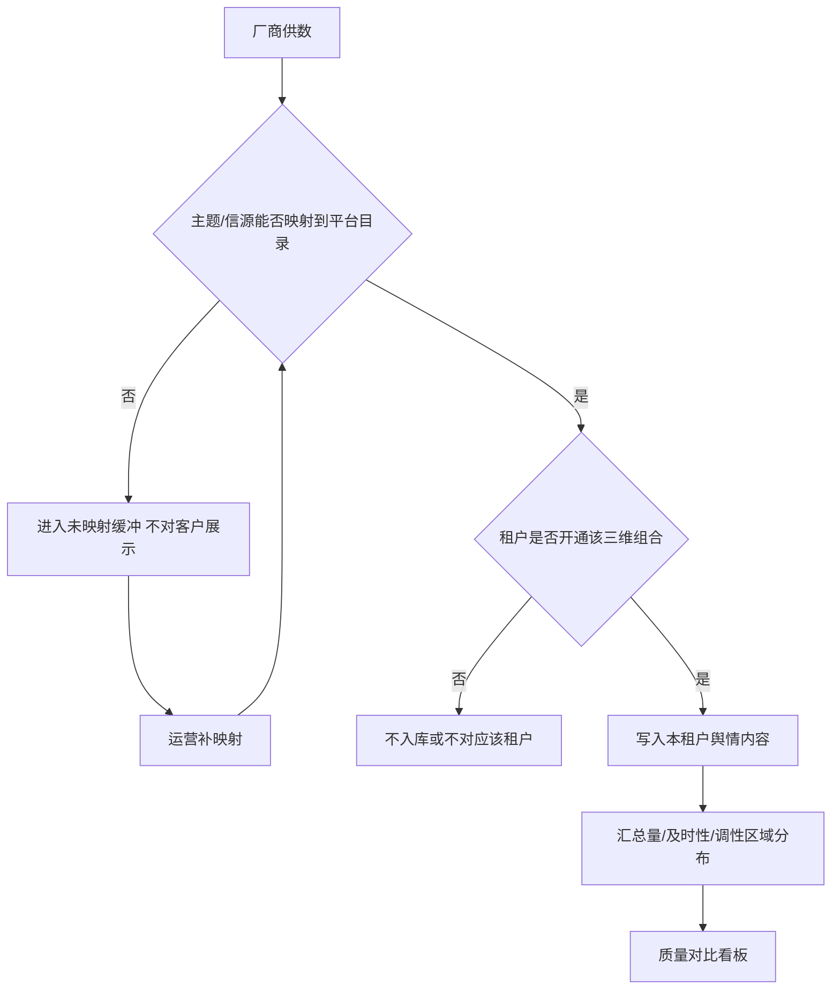
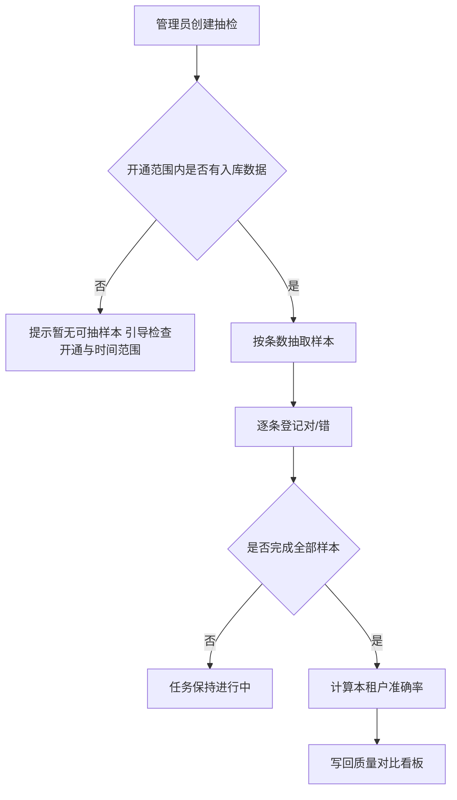
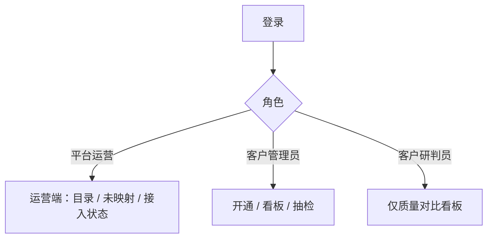

> **文档类型**：落地需求文档（PRD）
> **交付模式**：快速（单文件；跳过独立概念版与 MVP 口头确认）
> **来源设计**：`docs/01-需求与规划/2026-09-01-云数中台-设计方案-v1.0.md`（头脑风暴已确认）
> **概念版**：无独立文件；见下方「第一部分 · 概念对齐」
> **文档版本**：v1.0
> **范围说明**：MVP / V1.0（仅展开 🔴 核心功能的 §5）
> **最后更新**：2026-09-01

# 云数中台 · 产品需求文档（PRD）

## 第一部分 · 概念对齐

> 这是一个给**平台运营、客户管理员、客户研判员**用的 **PC Web 多租户中台**，帮他们**汇聚多家厂商舆情数据、按三维自选开通，并在同口径下对比供数质量**。
> 与各厂商各自后台或人工对账相比，核心差异是：**统一目录、客户自选「厂商 × 主题/领域 × 信源」、原始数据落库、看板回显厂商研判分布，中台不改判**。
>
> **形态**：PC Web（一期无 H5）。**策略**：先能力底座，不绑行业包；明细下钻、开放生态后期再做。
> **价值**：客户按需买数、可比质量；公司可复用一套目录服务多租户。
> **不做**：中台研判改判、研判员单条工作台、跨租户准确率排行、外部推送、H5。

---

## 第二部分 · 落地需求

## 1 产品概述

云数中台是公司第一套统一入口：平台维护厂商、主题/领域、信源目录并接入舆情原文；客户租户勾选开通组合后，在本租户内对比数据量、占比、及时性（中台实测）、准确性（本租户抽检）以及调性/区域等厂商研判分布。

一期验证「目录 + 开通 + 落库 + 三维质量对比 + 抽检」，界面以看板和抽检为主，不为研判员提供单条正文工作台。

## 2 目标用户与使用场景

### 2.1 用户画像

| 角色 | 是谁 | 痛点 | 一期核心诉求 |
| --- | --- | --- | --- |
| 平台运营 | 公司侧维护目录与对接的人 | 厂商标签不统一、无法按客户裁剪供数 | 维护三维主数据、处理未映射、看接入是否正常 |
| 客户管理员 | 租户内负责开通与质检的人 | 只能买全量包、准确性口说无凭 | 勾选开通、抽检打对错、看本租户看板 |
| 客户研判员 | 租户内看质量对比的人 | 各厂商后台口径不一、无法横比 | 只读看板，不下钻、不抽检、不改判 |

### 2.2 典型场景

1. **开通**：管理员进入数据开通，勾选「厂商 A × 民生 × 微博」等组合并启用 → 该组合开始入库，看板出现对应切片。
2. **对比**：研判员选时间范围与「民生 + 微博」，横比厂商 A/B 的条数、占比、延迟、抽检准确率、正中负占比。
3. **抽检**：管理员对某开通组合抽 50 条，对照正文判断厂商调性对错 → 本租户该范围准确率更新到看板；其他租户不可见。

---

## 3 核心用户动线

### 3.1 供数到看板（主流程 + 未映射）



### 3.2 抽检准确率（主流程 + 空样本）



### 3.3 角色入口



---

## 4 功能清单

```
云数中台
├── 🔴 账号与租户
│   └── 登录与按角色进入运营端或客户端（租户隔离）
├── 🔴 厂商与数据目录（运营）
│   ├── 厂商启用/停用
│   ├── 主题/领域目录
│   └── 信源类型
├── 🔴 供数接入
│   ├── 原文落库（标题/正文/URL/时间/厂商研判字段）
│   ├── 三维映射
│   ├── 未映射缓冲
│   └── 接入状态（入库量、延迟异常提示）
├── 🔴 数据开通（客户管理员）
│   └── 三维组合勾选、启用/停用
├── 🔴 质量对比看板（管理员 + 研判员只读）
│   └── 量、占比、及时性、准确性、调性/区域分布
├── 🔴 抽检与准确性（仅客户管理员）
│   └── 抽样、打对错、本租户准确率
├── 🟡 明细下钻与研判员看正文
├── 🟡 行业包 / 更细类目 / 计量计费
├── 🟡 平台级基准准确率
└── ⚪ 开放生态（外部接入、结果外推）、H5、跨厂商去重合并
```

本期 MVP 共 **6** 个 🔴 模块（登录与租户、目录、接入、开通、看板、抽检），下列 §5 全部展开。

### 4.1 关键页面布局：质量对比看板

```
┌─────────────────────────────────────────────────────────────────┐
│  云数中台          质量对比     [租户名]  [管理员/研判员]  [退出]  │
├──────────┬──────────────────────────────────────────────────────┤
│          │  质量对比                                             │
│  数据开通│  ┌──────────────────────────────────────────────────┐ │
│  质量对比│  │ 时间  [近7天 ▾]  主题 [民生 ▾]  信源 [微博 ▾]     │ │
│  抽检任务│  │ 厂商 [已开通多选]                    [查询]        │ │
│  （研判员│  └──────────────────────────────────────────────────┘ │
│   无开通、│  对比表格 ← 视觉重心                                  │
│   无抽检）│  厂商 | 数据量 | 占比 | 及时性(中位/P90) | 准确率 |    │
│          │       | 正/中/负占比 | 区域分布(有则示)               │
│          │  无下钻链接；准确率无抽检时显示「暂无抽检」            │
└──────────┴──────────────────────────────────────────────────────┘
```

---

## 5 功能详细描述

### 5.1 登录与租户隔离

**功能描述**：用户使用账号登录后进入本租户（或运营端）。菜单与数据范围由角色决定，租户之间不可见开通范围、舆情内容、抽检结论与准确率。

**触发条件**：访问系统未登录，或登录态失效。

**交互细节**：

| 场景 | 交互处理方式 |
| --- | --- |
| 操作反馈 | 登录按钮 loading；成功后进入默认页（运营→厂商管理；管理员→质量对比；研判员→质量对比） |
| 危险操作确认 | 退出登录需确认：「确定退出？」 |
| 空状态引导 | 无 |
| 操作失败引导 | 账号或密码错误：「账号或密码不正确，请重新输入」；无租户：「账号未关联客户，请联系平台运营」 |

**状态清单**：

| 状态 | 触发条件 | UI 表现 | 用户可执行操作 |
| --- | --- | --- | --- |
| 默认 | 打开登录页 | 账号、密码表单 | 登录 |
| 加载中 | 点击登录 | 按钮 loading，不可连点 | 无 |
| 成功 | 校验通过 | 进入对应端 | 使用系统 |
| 失败 | 校验失败 | 表单下红色错误文案 | 重试 |
| 禁用 | 账号停用 | 「账号已停用，请联系平台运营」 | 无 |
| 无权限页 | 已登录但访问无权限菜单 | 无权限提示，不展示数据 | 返回有权限页 |

**边界条件**：

- 会话超时：跳转登录页，提示「登录已过期，请重新登录」
- 网络异常：提示「网络异常，请稍后重试」并保留已填账号
- 并发：同一账号多处登录 [待补充：是否互踢，影响 5.1]
- 登录方式：一期账号密码；SSO / 企业微信 [待补充：若客户强制 SSO，影响 5.1 与 §7]

**数据规范**：

| 字段名 | 类型 | 长度/大小 | 必填 | 默认值 | 格式 | 校验 |
| --- | --- | --- | --- | --- | --- | --- |
| account | string | 4–64 | 是 | — | 字母数字或邮箱 | 非空 |
| password | string | 6–64 | 是 | — | — | 非空，不明文回显 |
| tenantId | string | — | 客户角色是 | — | — | 客户用户必须绑定唯一租户 |
| role | enum | — | 是 | — | operator / tenant_admin / tenant_analyst | — |

**验收标准**：

- [ ] 三种角色登录后菜单符合 3.6：研判员不见「数据开通」「抽检任务」
- [ ] 租户 A 接口与页面拿不到租户 B 的开通、内容、抽检数据
- [ ] 错误密码不进入系统，文案不含「用户是否存在」以外的多余信息

---

### 5.2 厂商与数据目录

**功能描述**：平台运营维护厂商、主题/领域、信源类型三份主数据。客户开通只能勾选「启用」中的项。厂商停用后停止向已开通客户写入新数据，历史统计可查。

**触发条件**：运营进入「厂商管理」「主题/领域」「信源类型」。

**交互细节**：

| 场景 | 交互处理方式 |
| --- | --- |
| 操作反馈 | 保存成功 toast「已保存」；列表刷新 |
| 危险操作确认 | 停用厂商：「停用后将停止向客户写入该厂商新数据，历史数据仍可统计。确定停用？」删除：仅当无开通引用时可删，否则禁止并提示「已被客户开通引用，请先停用」 |
| 空状态引导 | 无厂商：「暂无厂商，请新建」+「新建厂商」 |
| 操作失败引导 | 名称重复：「该名称已存在」 |

**状态清单**：

| 状态 | 触发条件 | UI 表现 | 用户可执行操作 |
| --- | --- | --- | --- |
| 默认 | 列表加载完 | 表格含名称、状态、更新时间 | 新建/编辑/启用/停用 |
| 加载中 | 拉取列表 | 表格骨架屏 | 不可重复点查询 |
| 成功 | 保存完成 | toast + 关闭抽屉 | 继续编辑其他 |
| 失败 | 校验或接口失败 | 字段红字或顶部错误 | 修改后重试 |
| 空状态 | 无记录 | 空插画 + 新建 | 新建 |

**边界条件**：

- 名称空或超过 50 字：拦截
- 主题/信源停用：已开通组合仍展示历史；新开通列表中不可再选该项
- 客户角色不可进入本模块

**数据规范**：

| 字段名 | 类型 | 长度/大小 | 必填 | 默认值 | 格式 | 校验 |
| --- | --- | --- | --- | --- | --- | --- |
| vendorName | string | 1–50 | 是 | — | — | 租户无关、全局唯一 |
| vendorCode | string | 2–32 | 是 | — | 字母数字下划线 | 对接标识，唯一 |
| vendorStatus | enum | — | 是 | enabled | enabled / disabled | — |
| topicName | string | 1–50 | 是 | — | — | 全局唯一 |
| sourceTypeName | string | 1–50 | 是 | — | — | 全局唯一 |

**验收标准**：

- [ ] 停用厂商后，已开通租户不再新增该厂商数据，看板历史时间范围仍有数
- [ ] 客户开通页只出现状态为启用的厂商/主题/信源

---

### 5.3 供数接入、映射与接入状态

**功能描述**：厂商数据进入中台后映射到平台三维目录并落库（标题、正文、URL、内容发布时间、到达中台时间、调性、区域等）。无法映射的进入未映射缓冲，不对客户展示。运营可查看接入状态（近期入库量、延迟是否异常）。

**触发条件**：数据到达中台；运营打开「未映射」「接入状态」。

**交互细节**：

| 场景 | 交互处理方式 |
| --- | --- |
| 操作反馈 | 补映射保存后，符合开通范围的数据进入对应租户，未映射列表减少 |
| 危险操作确认 | 丢弃未映射：「丢弃后无法再进入客户库，确定丢弃？」 |
| 空状态引导 | 未映射为空：「暂无未映射数据」 |
| 操作失败引导 | 映射目标已停用：「请选择启用中的主题/信源」 |

**状态清单**：

| 状态 | 触发条件 | UI 表现 | 用户可执行操作 |
| --- | --- | --- | --- |
| 未映射 | 厂商标签无法对应目录 | 未映射列表 | 补映射 / 丢弃 |
| 已入客户库 | 已映射且租户已开通 | 接入状态计入入库量 | 只读统计 |
| 延迟异常 | 近 1 小时入库中位延迟超过阈值 | 接入状态标异常 | 查看厂商维度提示 |
| 加载中 | 打开接入状态 | 数字骨架 | 等待 |

**边界条件**：

- 无内容发布时间：及时性用厂商推送时间；两者皆无则该条不计入及时性，计入数据量
- 调性为空：不计入调性分布，计入数据量
- 同一 URL 多家厂商各报一次：分别落库，不去重
- 延迟异常阈值：默认中位延迟 > 30 分钟标异常 [待补充：是否按厂商 SLA 可配，影响接入状态]

**数据规范**（舆情内容）：

| 字段名 | 类型 | 长度/大小 | 必填 | 默认值 | 格式 | 校验 |
| --- | --- | --- | --- | --- | --- | --- |
| title | string | 1–500 | 是 | — | — | 空则入未映射或丢弃规则见运营配置，一期空标题记「（无标题）」 |
| content | string | ≤200000 | 否 | — | — | 超长截断存储并标记 |
| url | string | ≤2000 | 否 | — | URL | — |
| publishedAt | datetime | — | 否 | — | — | 及时性优先用此 |
| pushedAt | datetime | — | 否 | — | — | 无 publishedAt 时用于及时性 |
| arrivedAt | datetime | — | 是 | 入库时刻 | — | 中台写入 |
| sentiment | enum | — | 否 | — | positive / neutral / negative | 厂商回显 |
| region | string | ≤100 | 否 | — | — | 厂商回显 |
| vendorContentId | string | ≤128 | 是 | — | — | 与厂商组合唯一 |

**验收标准**：

- [ ] 未映射数据不出现在任何客户看板与抽检池
- [ ] 补映射后，仅已开通对应组合的租户能统计到这些数据
- [ ] 接入状态能按厂商看到近期入库量；异常有明确标识

---

### 5.4 数据开通

**功能描述**：客户管理员从启用中的厂商、主题、信源勾选三维组合并启用。启用后该组合供数、进看板、可抽检。停用后停新数，历史可按时间范围对比。

**触发条件**：管理员打开「数据开通」。

**交互细节**：

| 场景 | 交互处理方式 |
| --- | --- |
| 操作反馈 | 开通成功 toast「已开通，后续数据将进入本客户统计」 |
| 危险操作确认 | 停用：「停用后不再写入该组合新数据，已有数据仍可按时间查看。确定停用？」 |
| 空状态引导 | 未开通任何组合：「请勾选厂商、主题和信源后开通」；目录为空：「暂无可开通项，请联系平台运营」 |
| 操作失败引导 | 重复开通：「该组合已开通」 |

**状态清单**：

| 状态 | 触发条件 | UI 表现 | 用户可执行操作 |
| --- | --- | --- | --- |
| 未开通 | 默认 | 组合出现在待选区 | 开通 |
| 已启用 | 开通且未停用 | 列表状态「启用中」 | 停用 |
| 已停用 | 管理员停用 | 状态「已停用」 | 重新启用 |
| 加载中 | 提交开通 | 按钮 loading | 不可连点 |

**边界条件**：

- 三维缺一不可勾选开通
- 研判员无此菜单
- 厂商或主题被平台停用：已开通组合自动停止新数，状态提示「上游已停用」

**数据规范**：

| 字段名 | 类型 | 长度/大小 | 必填 | 默认值 | 格式 | 校验 |
| --- | --- | --- | --- | --- | --- | --- |
| tenantId | string | — | 是 | 当前租户 | — | — |
| vendorId | string | — | 是 | — | — | 须为启用厂商 |
| topicId | string | — | 是 | — | — | 须为启用主题 |
| sourceTypeId | string | — | 是 | — | — | 须为启用信源 |
| comboStatus | enum | — | 是 | enabled | enabled / disabled | — |

**验收标准**：

- [ ] 未开通组合不出现在本租户看板切片与抽检可选范围
- [ ] 停用后新数据不再进入该租户该组合，历史时间范围内仍可统计

---

### 5.5 质量对比看板

**功能描述**：在本租户已开通范围内，按时间与三维切片横比各厂商：数据量、占比、及时性（发布时间或推送时间相对到达时间的中位数与 P90）、准确性（本租户抽检）、调性正/中/负占比、区域分布（有值才展示）。只读，无单条下钻。

**触发条件**：管理员或研判员进入「质量对比」；默认时间「近 7 天」。

**交互细节**：

| 场景 | 交互处理方式 |
| --- | --- |
| 操作反馈 | 查询时表格骨架屏，完成后展示 |
| 危险操作确认 | 无 |
| 空状态引导 | 无开通：「请先开通数据」（仅管理员显示按钮「去开通」；研判员显示「暂无已开通数据，请联系管理员」） |
| 操作失败引导 | 查询失败：「统计加载失败，请重试」 |

**状态清单**：

| 状态 | 触发条件 | UI 表现 | 用户可执行操作 |
| --- | --- | --- | --- |
| 默认 | 有开通且有统计 | 对比表 | 改筛选后查询 |
| 加载中 | 查询 | 骨架屏 | 不可连点查询 |
| 空开通 | 无启用中组合 | 空态文案 | 管理员可去开通 |
| 空数据 | 有开通但时间范围内 0 条 | 「该条件下暂无数据」 | 调整时间或维度 |
| 准确率空 | 该切片未完成抽检 | 「暂无抽检」 | 管理员可去抽检 |
| 无权限 | 非本租户 | 不展示他人数据 | — |

**及时性口径**：延迟 = arrivedAt − publishedAt（无 publishedAt 则 − pushedAt）；两者皆无则该条不进入及时性样本。看板展示该切片各厂商延迟中位数与 P90（单位：分钟）。

**准确性口径**：该切片下本租户已完成抽检样本中「对」的条数 / 已完成抽检条数；无完成抽检则「暂无抽检」。

**边界条件**：

- 筛选仅列出本租户已开通的主题/信源/厂商
- 占比分母为当前切片内各厂商数据量之和
- 研判员点击行无跳转、无「查看明细」
- 跨租户准确率不可见、无排行榜

**数据规范**（查询参数）：

| 字段名 | 类型 | 长度/大小 | 必填 | 默认值 | 格式 | 校验 |
| --- | --- | --- | --- | --- | --- | --- |
| timeFrom / timeTo | datetime | — | 是 | 近 7 天 | — | 跨度上限 90 天 |
| topicIds | id[] | — | 否 | 全部已开通 | — | 须属本租户开通 |
| sourceTypeIds | id[] | — | 否 | 全部已开通 | — | 同上 |
| vendorIds | id[] | — | 否 | 全部已开通 | — | 同上 |

**验收标准**：

- [ ] 同一筛选下各厂商数据量之和等于切片总量；占比合计 100%（允许四舍五入 0.1% 误差）
- [ ] 无发布时间且无推送时间的条目计入数据量、不拉低及时性
- [ ] 调性为空不计入正中负占比分母
- [ ] 研判员界面无开通、抽检入口，表格行不可进正文

---

### 5.6 抽检与准确性

**功能描述**：管理员从本租户已开通且已入库的数据中抽样，查看标题/正文/URL 及厂商调性等，登记对/错（一期以调性是否正确为主，区域对错可选）。不修改厂商原值。完成后计算本租户该范围准确率并回写看板。

**触发条件**：管理员进入「抽检任务」并新建。

**交互细节**：

| 场景 | 交互处理方式 |
| --- | --- |
| 操作反馈 | 创建后进入样本列表；每条保存对/错后即时标记已判 |
| 危险操作确认 | 放弃任务：「未完成的抽检不计入准确率，确定放弃？」 |
| 空状态引导 | 无任务：「创建抽检任务」；抽取结果 0 条：见失败引导 |
| 操作失败引导 | 无可抽数据：「该组合在时间范围内没有数据，请调整条件」 |

**状态清单**：

| 状态 | 触发条件 | UI 表现 | 用户可执行操作 |
| --- | --- | --- | --- |
| 进行中 | 已抽取且未全部判定 | 进度 n/N | 继续打标 |
| 已完成 | 全部样本已判对错 | 展示准确率 | 只读查看 |
| 已放弃 | 确认放弃 | 不计入看板 | 无 |
| 加载中 | 抽取中 | loading「正在抽样」 | 不可重复提交同一条件 |

**边界条件**：

- 抽取条数默认 20，允许 1–200；超过池内条数则抽完全部并提示「仅抽到 X 条」
- 样本仅本租户、仅已开通组合
- 研判员与运营无打标入口
- 并发：同一任务仅创建人可判；刷新后展示最新结论
- 准确率不共享给其他租户

**数据规范**：

| 字段名 | 类型 | 长度/大小 | 必填 | 默认值 | 格式 | 校验 |
| --- | --- | --- | --- | --- | --- | --- |
| comboId | string | — | 是 | — | — | 本租户已开通 |
| timeFrom / timeTo | datetime | — | 是 | — | — | — |
| sampleSize | number | 1–200 | 是 | 20 | 整数 | — |
| sentimentCorrect | enum | — | 是 | — | correct / incorrect | 调性对错 |
| regionCorrect | enum | — | 否 | — | correct / incorrect | 可选 |

**验收标准**：

- [ ] 完成任务后，对应切片准确率 = 调性判定为「对」的条数 / 已完成条数
- [ ] 抽检不改变内容上的厂商调性字段
- [ ] 租户 B 看板看不到租户 A 的准确率
- [ ] 放弃的任务不更新看板准确率

---

## 6 文案规范

**6.1 整体风格**：专业严谨，句子短，避免营销词。

**6.3 面向终端用户**：

| 场景 | 文案内容 | 风格备注 |
| --- | --- | --- |
| 页面标题 | 数据开通 / 质量对比 / 抽检任务 / 厂商管理 | 与菜单一致 |
| 空状态（无开通） | 暂无已开通数据，请先勾选厂商、主题和信源 | 研判员改为请联系管理员 |
| 空状态（无抽检） | 暂无抽检 | 不说「准确率为 0」 |
| 按钮 | 开通、停用、查询、创建抽检、判定为正确、判定为错误 | 动词开头 |
| 成功 | 已开通，后续数据将进入本客户统计 | — |
| 错误 | 该组合在时间范围内没有数据，请调整条件 | 原因 + 下一步 |
| 危险确认 | 停用后不再写入该组合新数据，已有数据仍可按时间查看。确定停用？ | — |
| 加载 | 正在抽样… / 统计加载中 | — |

---

## 7 非功能性需求

产品类型：B2B SaaS / 企业后台。

| 维度 | 要求 |
| --- | --- |
| 性能 | 登录后默认页 3 秒内可交互；看板查询 5 秒内返回（单切片、近 7 天）；抽检抽取 200 条内 10 秒内完成 |
| 权限 | 须登录；三角色互斥菜单；所有列表与统计强制租户过滤（运营看全局目录与接入，不看客户抽检明细） |
| 兼容性 | Chrome / Edge 近两个正式版本，桌面宽度 ≥ 1280 |
| 安全 | HTTPS；密码不明文存储与回显；正文在抽检页展示，研判员不可见原文；日志不打密码 |
| 存储 | 原文落库；保留策略 [待补充：是否按租户 mill 定期清理，影响存储与合规] |
| 多租户 | 数据按 tenantId 隔离；准确率、开通、内容均隔离 |
| 审计 | 一期记录：开通/停用、抽检判定、目录停用（操作者、时间、对象）；保留至少 180 天 |
| 批量/并发 | 抽检任务内逐条保存，避免覆盖他人未实现「多人同判一任务」（一期单创建人） |
| SLA | 一期不对客户承诺可用性数字 |
| SSO | [待补充] |

---

## 8 待确认问题

- [ ] 登录是否必须对接 SSO / 企业微信（影响 5.1、§7）
- [ ] 接入延迟异常阈值是否按厂商可配，默认 30 分钟是否合适（影响 5.3）
- [ ] 原文保留多久、是否按租户清理（影响 §7 存储）
- [ ] 同一账号多端登录是否互踢（影响 5.1）
- [ ] 抽检「对」是否仅调性，区域可选是否计入准确率分母（当前：**准确率只按调性对错**；区域不计入分母）

---

## 附录 · 快速模式自检（P0）

| 项 | 结果 |
| --- | --- |
| 已读设计方案（read-first） | 是 |
| 模式 A + 快速单文件（第一/第二部分） | 是 |
| 路径 `docs/2026-09-01-云数中台-PRD.md` | 是 |
| §3 含异常分支（未映射、无样本） | 是 |
| §4.1 核心页 ASCII | 是 |
| 6 个 🔴 均有独立 §5；🟡⚪ 未展开 | 是 |
| §7 含 B2B 多租户/权限/审计 | 是 |
