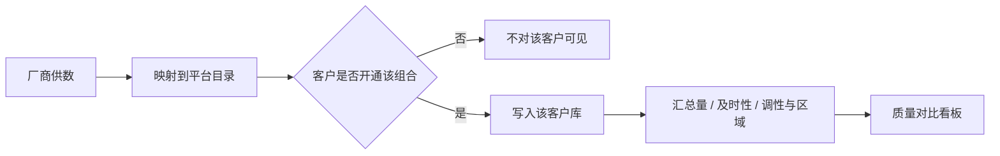

# 云数中台 · 产品立项汇报方案

**受众**：公司领导 / 决策层  
**类型**：产品立项与方向对齐（非正式月报）  
**时长建议**：10–15 分钟讲解 + 5 分钟问答  
**日期**：2026-09-01  
**依据**：`docs/01-需求与规划/2026-09-01-云数中台-设计方案-v1.0.md`、`docs/2026-09-01-云数中台-PRD.md`  
**决策诉求**：确认一期产品定位、用户与范围，批准按「能力底座」推进，不把研判操作和开放生态放入一期。

---

## 先说结论（1 分钟）

云数中台是公司 **第一套统一入口**：把多家厂商的舆情数据收进来，让客户按「厂商 × 主题/领域 × 信源」自选开通，再用同一口径对比 **数量、及时性、准确性**，并 **回显** 厂商已有的调性、区域等研判结果。

| 要拍板的三件事 | 建议 |
|----------------|------|
| 一期做什么 | 目录 + 多租户开通 + 原文落库 + 三维质量看板 + 本客户抽检 |
| 一期不做什么 | 中台里改判、研判员看单条正文、对外推送、行业包、H5 |
| 做成什么样 | PC Web 多租户；公司运营维护目录，客户自己勾选、自己抽检 |

请领导确认：**方向对、范围收得住**，即可进入 SRS 与研发排期。

---

## 一、为什么现在做（Why）

### 问题

1. **数在厂商侧、口径不统一**：客户要横比几家供数质量，只能进多家后台或靠人工对账。  
2. **只能买包、不能自选**：客户往往不需要全量，需要按厂商、主题、信源裁剪。  
3. **质量口说无凭**：及时性、准确性缺少本客户可核验的口径；中台若自己做研判，会做成又一个前台产品，偏离「中台」定位。

### 机会（相对现有方式）

- 对公司：一套目录服务多个客户，后续可接更多厂商和生态。  
- 对客户：按需开通、同屏对比、抽检可解释。  
- 对研发：先做底座，不绑死政务/品牌行业包，降低返工。

（市场规模与收入测算本期无量化材料，不在此编造；商业路径见第四节原则。）

---

## 二、产品定位（What）

**一句话**：给客户和公司运营用的 **PC 舆情数据中台**——汇聚多厂商数据、客户自选开通、统一对比供数质量；**不替代厂商做研判**。

| 维度 | 一期定位 |
|------|----------|
| 是什么 | 多租户数据中台 + 质量对比 |
| 不是什么 | 不是舆情研判工作台，不是行业应用前台，不是开放数据市场 |
| 形态 | PC Web（不做 H5） |
| 策略 | 能力底座；行业包、明细下钻、结果外推放后期 |

**差异化**：统一三维目录、客户勾选组合、原文落库、看板回显厂商研判分布、准确性来自 **本租户抽检**（不共享、不做全平台排行）。

---

## 三、用户群体

三类角色，同一套系统、权限分开；客户数据按租户隔离。

| 角色 | 归属 | 他们要完成的事 | 一期不让他们做的事 |
|------|------|----------------|--------------------|
| **平台运营** | 公司 | 维护厂商、主题、信源；处理标签映射；看接入是否正常 | 代替客户抽检、看客户抽检明细 |
| **客户管理员** | 租户 | 勾选开通组合；抽检打对错；看本客户看板 | 改厂商调性原值 |
| **客户研判员** | 租户 | **只看** 本客户质量对比看板 | 看单条正文、抽检、改判 |

**给领导的记忆点**：研判员是「看质量」的人，不是「写研判」的人；写研判仍在厂商侧，中台只汇总展示。

---

## 四、核心业务流程

主链路一条，抽检是质量闭环，不进入研判生产。

### 4.1 供数 → 开通 → 看板（主业务）

- 映射不上：进「未映射」缓冲，客户看不见，运营补映射后再按开通范围入库。  
- 及时性：内容发布时间（或推送时间）对比到达中台时间，中台实测，不是厂商口头承诺。

### 4.2 抽检 → 准确率（仅管理员）

- 不改厂商原值；其他客户看不到这次抽检结果。

### 4.3 谁在哪条路上

| 流程环节 | 平台运营 | 客户管理员 | 客户研判员 |
|----------|----------|------------|------------|
| 目录与映射 | 主责 | — | — |
| 勾选开通 | — | 主责 | — |
| 看质量看板 | 可选接入概况 | 可看 | 主责（只读） |
| 抽检打对错 | 不做 | 主责 | 不做 |

---

## 五、核心功能模块（一期 MVP）

建议汇报时只讲这 **6 块**，其余标为后期。

| 模块 | 解决什么 | 领导怎么验收「做成了」 |
|------|----------|------------------------|
| **1. 登录与租户** | 多客户隔离、三角色进不同菜单 | 甲客户看不到乙客户的数和准确率 |
| **2. 厂商与目录** | 统一厂商、主题/领域、信源 | 客户开通只能勾选启用中的目录项 |
| **3. 供数接入** | 原文落库 + 未映射缓冲 + 接入状态 | 未映射不进客户看板；映射后按开通入库 |
| **4. 数据开通** | 三维组合启停 | 未开通的切片看板里没有 |
| **5. 质量对比看板** | 同切片比量、占比、及时性、准确率、调性/区域 | 研判员不能点进单条 |
| **6. 抽检** | 本客户准确率可解释 | 抽检不改原值；准确率不跨客户 |

**三维质量对比**（避免会上被追问）：同一筛选下（例如「民生 + 微博」）横比各厂商的条数、占比、到达延迟、抽检准确率、正/中/负与区域分布。

### 一期明确不做（建议会上主动讲，避免范围膨胀）

- 中台内写结论、改调性、改等级  
- 研判员单条正文工作台  
- 跨客户准确率排行、平台统一准确率  
- 外部系统推送、开放 API 生态  
- 行业定制包、移动端 H5  
- 跨厂商同一 URL 自动去重合并  

### 后期（只表态，不本期要资源）

明细下钻、行业包、计量计费、平台级基准准确率、外部接入与结果外推。

---

## 六、商业与假设（原则，无编造数字）

| 原则 | 说明 |
|------|------|
| 对公司 | 中台复用：一次对接厂商、多次卖给客户组合 |
| 对客户 | 按开通范围供数，质量可比、可抽检，降低「买贵了/买错了」 |
| 关键假设 | 客户愿意为「可对比的质量」付费或续约；厂商能按约定供原文与研判字段 |
| 验证方式 | 一期先跑通 1–2 个租户、2 家以上厂商的开通与看板，再谈计费与生态 |

资源与排期以 SRS 后的交付计划为准，本次汇报不锁人天。

---

## 七、风险（主动暴露）

| 风险 | 可能 | 影响 | 应对 |
|------|------|------|------|
| 厂商标签杂、映射成本高 | 高 | 客户侧长期无数据 | 未映射缓冲 + 运营补映射，不阻塞开通配置 |
| 把中台做成研判产品 | 中 | 范围失控、与前台抢定位 | 一期写死：只回显、不改判；研判员无明细 |
| 抽检样本少、准确率被质疑 | 中 | 看板数字不可信 | 口径写清：本客户、本范围、调性对错；未抽检显示「暂无」而非 0 |
| 及时性缺发布时间 | 中 | 延迟算不准 | 回退推送时间；两者都无则该条不计入及时性 |

---

## 八、建议决策与下一步

**建议**：批准按上述定位与一期范围立项；细节以已确认设计方案和 PRD 为准。

**若批准，下一步**：

1. PRD 转 SRS（菜单、页面清单、功能详细设计）  
2. 交付计划与排期  
3. 按 SRS 实现 PC 管理端（运营端 + 客户端）  

**若需调整**，优先裁定下面任一即可，不必推翻中台定位：

- 研判员一期是否允许看样本（仍不改判）  
- 准确性是否改为厂商自报、抽检后置  

---

## 附录：讲解顺序（可当逐页提纲）

| 页 | 内容 | 时长 |
|----|------|------|
| 1 | 结论三句话 + 请领导拍的三件事 | 1 分钟 |
| 2 | 为什么做（三个问题） | 2 分钟 |
| 3 | 定位：是中台不是研判台 | 2 分钟 |
| 4 | 三个角色一张表 | 2 分钟 |
| 5 | 主流程图（供数→开通→看板）+ 抽检闭环 | 3 分钟 |
| 6 | 六个模块 + 不做清单 | 3 分钟 |
| 7 | 风险与决策 | 2 分钟 |

**材料路径**

- 本汇报：`docs/2026-09-01-云数中台-立项汇报.md`  
- 设计方案：`docs/01-需求与规划/2026-09-01-云数中台-设计方案-v1.0.md`  
- PRD：`docs/2026-09-01-云数中台-PRD.md`  

汇报人、编制单位请会前补上。需要做成幻灯片页或 Word 时再说明即可。
