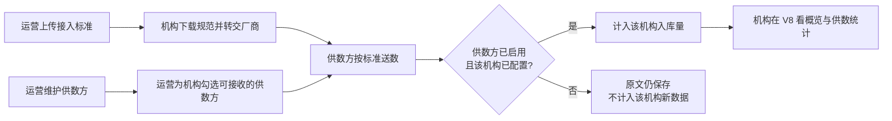

# 云数中台 · 核心业务与功能汇报

**受众**：公司领导 / 决策层  
**类型**：产品方案对齐（核心流程 + 一期功能）  
**时长建议**：8–10 分钟讲解 + 问答  
**日期**：2026-09-03  
**依据**：`docs/01-需求与规划/2026-09-03-云数中台-设计方案-v1.1.md`、`docs/01-需求与规划/20260903-云数中台-SRS需求规格说明书-V1.0.md`  
**说明**：9 月 1 日立项材料中的「三维开通、及时性/抽检/调性看板」已调整为后期，本期以本文为准。

---

## 先说结论

云数中台是公司 **第一套统一入口**：把康奈和各厂商承诺给机构的舆情数据，按中台规定的标准接进来、原文入库；机构在 **V8** 核对「数据有没有到、各家到了多少」，并下载一份接入规范转交给厂商。

| 要记住的三句话 | 含义 |
|----------------|------|
| 一期做接入走通 | 标准发布、供数配置、原文入库、按供数方看出库量 |
| 一期不做研判 | 中台不代替厂商研判、不改判、两端都不看正文 |
| 两端分工清楚 | V8 = 机构用；MT = 我司运营用 |

**建议确认**：方向按「能力底座、先接进来」推进；质量对比、抽检、按区域切片放到后期。

---

## 一、为什么先做这一期

当前痛点有三条，都卡在「还没接进来」：

1. **口径不统一**：各厂商格式自行约定，机构和公司难以按同一套要求对接、对账。  
2. **标准拿不到手**：接入要求散落在线下，机构不便下载并转交给供数方。  
3. **到没到说不清**：缺少按供数方查看本机构入库量的统一入口。

质量对比（及时性、准确性、调性分布）仍然是后续方向，但必须先有统一接入和原文入库，否则对比没有底座。

---

## 二、产品定位与两端

**一句话**：多租户舆情数据中台——中台定标准、供数方按标准送数、机构核验入库量；**不替代厂商做研判**。

| 维度 | 本期 |
|------|------|
| 是什么 | 统一接入 + 原文入库 + 按供数方核验条数 |
| 不是什么 | 不是研判工作台，不是行业应用前台，不是开放数据市场 |
| 形态 | PC Web；不做移动端 |
| 两端 | **V8 应用端**（机构）／ **MT 管理端**（我司运营） |

**两类使用者**

| 角色 | 在哪用 | 要完成的事 | 不做什么 |
|------|--------|------------|----------|
| 机构管理员 | V8 | 看概览与各供数方入库量；查看已配置供数方；下载接入规范 | 自己勾选开通、上传标准、看正文 |
| 平台运营 | MT | 维护供数方（含康奈）；给机构指定可接收的供数方；上传/替换标准 | 代替机构做业务核验、查阅正文 |

账号与机构信息复用现有 V8、MT 体系，业务数据按机构隔离。本期机构侧只有机构管理员，权限按角色预留，后期加角色不必改主流程。

---

## 三、核心业务流程（一条主链路）

主链路只有一条：**定标准 → 配关系 → 按标准送数入库 → 机构看量**。

分三步看：

**第一步，把规则讲清楚**  
运营在 MT 上传全平台 **一份** 接入标准（Word/PDF）。机构在 V8「接入规范」下载后转交厂商。中台规定格式和元数据，厂商按这一份标准送数。

**第二步，把「谁给谁供数」配好**  
运营维护供数方名单（康奈与外部厂商同一份名单），再按机构勾选可接收哪些供数方。机构 **没有** 开通页，不能自己勾选。

**第三步，数据进来，机构只核验条数**  
供数方送来后，系统按供数方编码、机构标识匹配。匹配成功且关系有效，则计入该机构；机构在 V8 按供数方看入库条数。原文（含区域、标题、正文等）落库，**本期界面不展示正文、不按区域切片**。

---

## 四、一期功能（领导一页看完）

### 4.1 机构侧 · V8

| 功能 | 机构用来做什么 |
|------|----------------|
| 数据概览 | 一进系统就看到：已配置供数方数量、入库总条数、最近一次入库时间；可进入供数统计或接入规范 |
| 供数统计 | 按供数方核对条数；可选全部 / 近 7 天 / 近 30 天（按到达中台时间）；已配置但未入库显示 0 |
| 供数方查看 | 只读本机构已配置的供数方名称和状态（启用/停用），不能增减 |
| 接入规范 | 查看并下载当前这一份标准，转交给供数厂商 |

### 4.2 运营侧 · MT

| 功能 | 运营用来做什么 |
|------|----------------|
| 供数方管理 | 登记康奈及各厂商：名称、编码、启用/停用；被机构引用后不可删除，只能停用 |
| 机构供数配置 | 按机构勾选可接收的供数方；未勾选的不计入该机构 |
| 接入标准管理 | 上传或替换全平台当前一份 Word/PDF；替换后机构只能下载新文件 |
| 按标准接入入库 | 系统能力，不是单独业务页：保存原文与元数据，并按配置决定是否计入机构统计 |

### 4.3 计入口径（避免会上被追问）

- **未配置不计入**：没给该机构勾选的供数方，即使送来数据，也不出现在该机构概览和统计里。  
- **停用停新数、不扣历史**：停用后不再为已配置机构计入该供数方新数据；原文仍保存；历史上已计入的条数不回扣。  
- **一条只归一个机构**：按送来的机构标识归属；对不上编码或机构的，不入库。  
- **总条数口径**：概览「入库总条数」= 供数统计「全部」，含已停用供数方的历史计入，不含停用后的新数据。

---

## 五、本期明确不做（后期保留）

| 后期方向 | 为什么现在不做 |
|----------|----------------|
| 厂商 × 主题 × 信源开通 | 一期先把「接进来」走通，开通改由运营代配供数方 |
| 及时性 / 抽检准确率 / 调性看板 | 需要先有稳定入库底座 |
| 按区域切片、查阅单条正文 | 区域等字段已入库预留；界面本期不切、不看 |
| 研判员独立菜单 | 权限点预留，本期机构侧仅管理员 |
| 标准多版本、按厂商拆文档 | 先保证全平台一份当前档，便于转发 |

---

## 六、当前进展与建议

**文档**：设计方案 v1.1、SRS V1.0 已按上述口径落稿。  
**原型**：V8（机构端）、MT（运营端）静态原型已按上述功能出页，可用于演示主路径。

**请领导确认的三件事**

1. 一期定位按「接入走通」还是仍要上质量对比（建议：先接入）。  
2. 机构侧是否维持「只看量、不看正文、不开通页」。  
3. 接入标准是否维持「全平台一份文档、机构下载转交厂商」。

确认后即可进入研发排期与联调准备。
