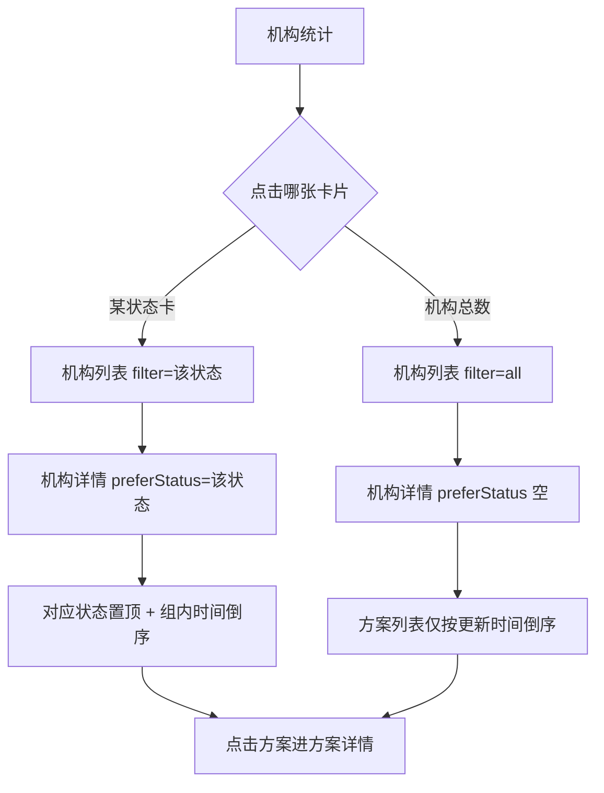

> **文档类型**：落地需求文档（PRD）  
> **交付模式**：快速（单文件；设计方案已确认，跳过独立概念版）  
> **来源设计**：`docs/01-需求与规划/2026-09-07-试用管理平台-H5机构详情方案排序-设计方案-v1.0.md`  
> **文档版本**：v1.0  
> **范围说明**：MVP / V1.0（仅展开 🔴）  
> **最后更新**：2026-09-07  

# 试用管理平台 · H5 机构详情产品方案列表排序 · PRD

## 第一部分 · 概念对齐

> 给**销售**在企业微信 H5「机构统计」里用的能力：从某状态机构下钻到机构详情时，**产品方案列表按入口状态置顶，并按最近写操作时间倒序**，让用户先看到与本次下钻意图相关的方案。  
> **形态**：H5。**策略**：只改机构详情列表排序与透传，不改列表页筛选口径、不强制展示更新时间。  
> **不做**：机构列表重排、排序控件、Web 管理端本期改造。

---

## 第二部分 · 落地需求

## 1 产品概述

在试用管理平台 H5 机构统计链路中，优化机构详情页「产品方案」列表排序：根据用户从哪张状态卡片进入，将对应状态方案置顶；组内与非置顶方案均按最近写操作时间倒序。从「机构总数」进入时不做状态置顶。

## 2 目标用户与使用场景

### 2.1 用户

| 角色 | 说明 |
|------|------|
| 销售（H5） | 查看负责统计单元下的机构与试用/申请中的产品方案 |

### 2.2 场景

1. **跟进申请中机构**：从「申请中机构」进入某机构详情，希望申请中方案排在最前，便于点进处理。  
2. **核查试用中方案**：从「试用中机构」进入，只希望「试用中」置顶；「即将到期」仍排在下方（严格单状态）。  
3. **浏览全量机构**：从「机构总数」进入详情，只想按最近有变动的方案优先看。

## 3 核心用户动线



## 4 功能清单

```
试用管理平台 H5 · 机构详情方案排序
├── 🔴 入口状态透传（统计 → 列表 → 详情）
├── 🔴 产品方案列表排序（状态置顶 + 更新时间倒序）
├── 🔴 机构详情查询支持 preferStatus
├── ⚪ 机构列表排序调整
└── ⚪ 方案卡片展示更新时间
```

### 4.1 关键页面线框（机构详情）

```
┌─────────────────────────────┐
│  ← 机构详情                  │
├─────────────────────────────┤
│  [徽] 机构名称               │
│       所属销售：xxx          │
├─────────────────────────────┤
│  产品方案                    │
│  ┌─────────────────────────┐│
│  │ [申请中]  产品A / 方案1  ││  ← 入口为申请中时置顶
│  └─────────────────────────┘│
│  ┌─────────────────────────┐│
│  │ [试用中]  产品B / 方案2  ││  ← 其余按更新时间倒序
│  └─────────────────────────┘│
└─────────────────────────────┘
```

## 5 功能详细描述

### 5.1 入口状态透传

**功能描述**：用户从统计卡片进入列表、再进详情时，详情须知道本次下钻的意图状态，以便排序。

**交互要点**：

- 统计卡片点击进入列表时携带 filter（现有能力延续）。  
- 列表点击机构进入详情时携带 preferStatus：`all` → 空；其余与 filter 同值。  
- 无透传（直链）：按 preferStatus 为空处理。

**业务规则**：

- preferStatus 取值：空 / 申请中 / 试用中 / 即将到期 / 已到期 / 冷冻期。  
- 「已停止试用机构」卡片对应 preferStatus = 已到期。

### 5.2 产品方案列表排序

**功能描述**：机构详情产品方案列表按规则排序后展示，用户不可手动改排序。

**排序规则**：

1. preferStatus 为空：全部按 updatedAt 倒序。  
2. preferStatus 非空：  
   - 组1：`status === preferStatus`，按 updatedAt 倒序；  
   - 组2：其余，按 updatedAt 倒序；  
   - 展示顺序 = 组1 + 组2。  
3. updatedAt 相同：按方案标识倒序。  
4. 置顶组为空：等同规则 1。

**置顶对照**：

| 入口 | 置顶状态 |
|------|----------|
| 机构总数 | 无 |
| 申请中机构 | 仅申请中 |
| 试用中机构 | 仅试用中（不含即将到期） |
| 即将到期机构 | 仅即将到期 |
| 已停止试用机构 | 仅已到期（不含停用） |
| 冷冻期机构 | 仅冷冻期 |

**更新时间口径**：方案记录最近一次写操作/保存时间（延期、关停、重置、更换方案、审核处理等）。

**空态**：无方案时沿用现有「暂无数据」类提示。

### 5.3 机构详情查询支持 preferStatus

**功能描述**：查询某机构详情及产品方案列表时，可传入 preferStatus；返回的方案列表须已按 5.2 排好序。

**业务规则**：

- 排序在服务端完成，客户端按返回顺序渲染。  
- 列表页筛选口径（如「试用中」机构含即将到期方案）本期不变，与详情置顶严格单状态可并存。

## 6 非功能需求

| 项 | 要求 |
|----|------|
| 一致性 | 同一 preferStatus + 同一数据，多次进入顺序一致（含平局规则） |
| 性能 | 单机构方案量级下排序对打开详情无明显延迟 |
| 兼容 | 不传 preferStatus 时行为等同「仅时间倒序」 |

## 7 验收标准

1. 从「申请中机构」进入详情：所有申请中方案在顶部，组内更新时间新→旧；其余在下按时间新→旧。  
2. 从「试用中机构」进入：「即将到期」不在置顶组。  
3. 从「机构总数」进入：无状态置顶，仅时间倒序。  
4. 写操作刷新 updatedAt 后，该方案在所在组内位置正确上移。  
5. 直链进详情且无 preferStatus：仅时间倒序。  

## 8 本期不做

- 机构列表排序改造  
- 方案卡片上展示更新时间  
- 用户手动切换排序方式  
- Web 管理端机构详情同步改造（另立需求）  
